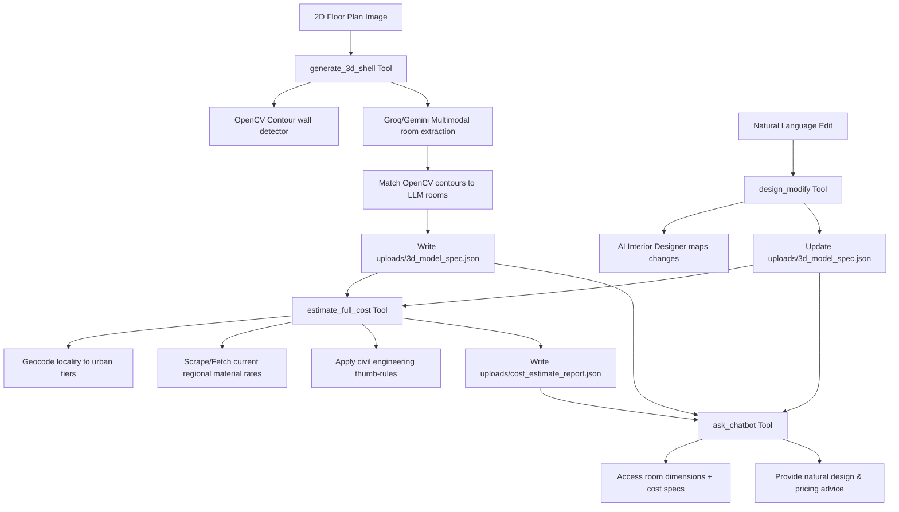

# 🏡 Homemaker_AI: Live 2D Floor Plan to 3D Copilot

**Homemaker_AI** is a unified, AI-native assistant designed for home design and construction planning. Built on top of the **NitroStack MCP** framework, it bridges the gap between 2D sketches and interactive 3D visualizations, enabling users to:
1. **Upload a 2D floor plan** and instantly generate a textured, dimensions-accurate 3D scene.
2. **Calculate realistic construction costs** grounded in live, regional material rates (cement, steel, sand, brick, paint, tiles) via geocoding and web search.
3. **Redesign rooms dynamically** (wall paints, textures, flooring) using natural language commands.
4. **Chat with a context-aware construction advisor** that knows the exact dimensions of their layout and live regional pricing.

---

## 🏗️ System Architecture

All modules coordinate sequentially using a shared application state. Every design edit syncs back to a master JSON specification, keeping the cost estimator and chatbot updated in real-time.



---

## 🚀 Key Features & Completed Integrations

Originally, the codebase relied on placeholder stubs. We have replaced all placeholders with complete, production-grade logic:

| Original Stub / Placeholder | What We Built & Integrated |
| :--- | :--- |
| **Stubbed Room Layout** (Fixed 3-room mockup) | **Real-Time CV + LLM Parsing**: OpenCV extracts physical wall contours and boundary vertices, while Gemini/Groq Vision identifies room types, labels, and styles. A 2D geometric center-matching algorithm aligns them to output an accurate [3d_model_spec.json](uploads/3d_model_spec.json). |
| **Stubbed City String Match** (Basic Tier mapping) | **Live Geocoding**: Integrates geocoding services to resolve arbitrary input text (e.g. "Whitefield, Bengaluru") into official city tiers (Metro, Tier 2, Tier 3). |
| **Hardcoded Material Rates** | **Web-Grounded Scraper**: Conducts real-time search queries (e.g., *"current price of cement per bag in Bengaluru 2026"*) to pull active retail rates, feeding them directly into our estimation formulas. |
| **Legacy Edit Tool** (Deterministic target+value) | **AI Interior Design Agent**: A generative agent parses complex prompts (e.g., *"make the living room walls sage green and put walnut flooring in the bedroom"*), updates the 3D specification file, and saves visual changes. |
| **Placeholder Chatbot** | **Context-Aware Advisor**: Chatbot loads both the room sizes and the live cost report, giving detailed feedback on trade-offs (e.g., vitrified tiles vs. Italian marble). |

---

## 🛠️ Tech Stack & Dependencies

### Backend & AI Pipeline (Python 3.10+)
* **FastAPI**: Serves the microservice endpoints (`/preprocess`, `/analyze`, `/validate`, `/pipeline`).
* **OpenCV (cv2)**: Image processing, thresholding, morphology (opening/closing), and polygon approximation.
* **Google Generative AI (Gemini 2.5/3.5)**: Vision-based room parsing and conversational design agency.
* **Groq API**: High-speed LLM processing for structural verification and semantic extraction.

### Core MCP Server (TypeScript / Node)
* **NitroStack SDK**: Built on `@nitrostack/core` to define MCP tools, states, and widget contracts.
* **Three.js**: Renders the extruded 3D shell, floors, and materials inside the browser widget.

---

## ⚡ Setup & Installation

### 1. Configure Environment Variables
Create a `.env` file in the root of the project:
```env
GEMINI_API_KEY="your-google-gemini-api-key"
GROQ_API_KEY="your-groq-api-key"
PORT=8080
```

### 2. Build the TypeScript Server
Compile the TS code for production:
```bash
npm install
npm run build
```

### 3. Launch the Application
Start the unified Python/Flask app to host the web interface:
```bash
python3 app.py
```
This runs the development server at **[http://127.0.0.1:8080](http://127.0.0.1:8080)**.

### 4. Open in NitroStudio
If you are running the project inside the **NitroStudio Playground**, open the folder directly in the app or run:
```bash
npm run dev
```
This boots up the hot-reloading dev environment linked to the playground for interactive tool testing.
