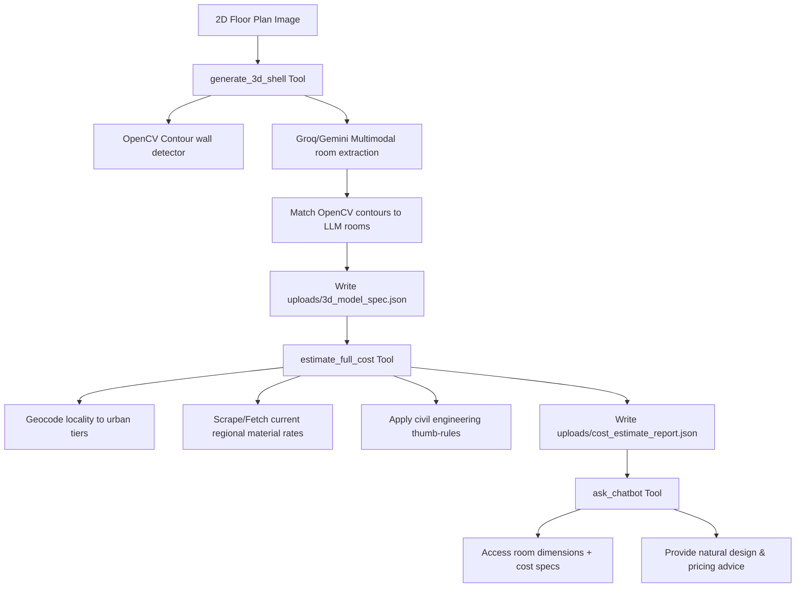

# 🚀 Homemaker_AI: Unified Project Walkthrough

This repository contains the complete, unified AI-powered interior design and construction co-pilot. It integrates **Computer Vision**, **Large Language Models (Gemini/Groq)**, **Live Web-Grounded Search**, **3D Scene Reconstruction**, and an **Interactive Chatbot** into a standard **NitroStack** MCP application.

---

## 🏗️ Architecture & Sequential Tool Sync

All components are integrated directly into the NitroStack MCP framework as tools, synchronizing one after another using shared session states:



---

## 🛠️ Tool Pipeline Details

### 1. `generate_3d_shell` (CV + LLM + 3D Spec)
* **Core Logic**: Runs [run_mcp_pipeline.py](run_mcp_pipeline.py).
* **CV segmentation**: OpenCV runs line and contour detection to find actual thick walls and room outlines.
* **LLM Vision**: Passes the image to Groq/Gemini to extract room categories, doors, windows, and custom styles.
* **Geometric Matching**: Calculates centers in 2D space to align raw OpenCV shapes with AI room names.
* **3D spec generation**: Synthesizes geometry + annotations, saving them to [uploads/3d_model_spec.json](uploads/3d_model_spec.json).

### 2. `estimate_full_cost` (Grounded Rates + Engineering Estimations)
* **Core Logic**: Runs [run_estimation.ts](run_estimation.ts).
* **Search Grounding**: Searches for active commodity rates in the local market (e.g. Whitefield, Bengaluru).
* **Formulas**: Computes steel rebar tonnage, cement bag counts, brick volumes, aggregates, vitrified tiles, and paint requirements.
* **Output**: Writes the results to [uploads/cost_estimate_report.json](uploads/cost_estimate_report.json).

### 3. `ask_chatbot` (Conversational Construction Advisor)
* **Core Logic**: Runs [run_chatbot.ts](run_chatbot.ts).
* **Context Loading**: Automatically parses the active room dimensions and material cost specifications.
* **Engineering Reasoning**: Responds to complex construction trade-offs (e.g. Vitrified Tiles vs. Italian Marble) with live cost multipliers.

---

## ⚡ How to Build & Run

### 1. Build the TypeScript Server
Compile all TypeScript files using the compiler config:
```bash
npm run build
```
*(Compiles cleanly with 0 errors into the `dist/` directory)*

### 2. Launch the Application Server
Run the Flask server with your Groq or Gemini API key set in the environment:
```bash
GEMINI_API_KEY="your-api-key" python3 app.py
```
This serves the frontend UI at **[http://127.0.0.1:8080](http://127.0.0.1:8080)**, which allows you to upload plans, render 3D scenes, trigger geocoded estimates, and chat in real-time.
